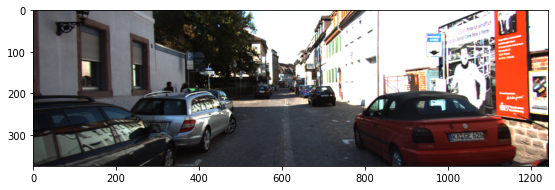
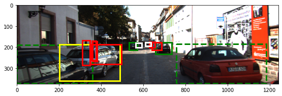
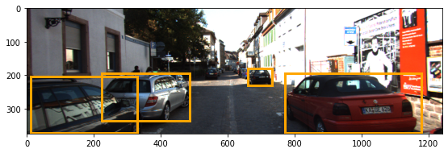
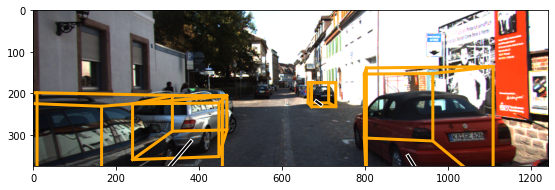

# 3D Object Detection for Autonomous Vehicles
## A FourthBrain AI Project

Authors:
* Leo Kosta: [Leo's github](https://github.com/kostaleonard)
* Ashish Mahashabde: [Ashish's github](https://github.com/amahashabde)

## Project Description

In order to effectively maneuver, autonomous vehicles rely on the ability to accurately estimate bounding boxes of various objects, including other vehicles. Companies like Lyft have recently experimented with using 3D bounding boxes, which could allow autonomous vehicles to have richer positioning information and make better predictions for maneuvering. By reimplementing recent methods and experimenting with new approaches, we want to improve on the state-of-the-art in bounding volume prediction in the self-driving car domain.

## Approach

Based on the literature we've reviewed (see [References](#references)), we used a 2D object detector to produce priors that help a 3D object detector draw accurate 3D bounding boxes. The 2D object detector draws a rectangular (2D) bounding box around the cars, and the 3D object detector uses those boxes to infer 6-sided (3D) bounding volumes. We use **only monocular RGB camera data**, with no depth information. 

Our goal is that you can clone this repository and run the model in a single command. When you're ready to check out how it works, you'll find well-written, well-documented, well-tested code.

## Run Instructions

Clone the repository and organize the datasets as shown in `./data/README.md`. Training, testing, and prediction can all be run from the project root using the `Makefile`.

To train the model, run:

```
make
```

To predict 3D bounding boxes on the training/validation/test datasets, run:

```
make predict_on_ground_truth_partition_{train, val, test}
```

To evaluate 3D bounding box predictions, run:

```
make eval_{train, val, test}_predictions
```

To gain familiarity with the model or data, you can also check the notebooks in `./notebooks/`.

## Examples

Here is an example image from the KITTI dataset.



Now we'll overlay the ground truth 2D bounding box information.



There are 2 border styles and 4 colors. A solid border indicates that the object was not truncated, while a dashed border indicates that it was (some portion of the object is off-camera). 3 of the colors indicate occlusion information: green is no occlusion, yellow is partially occluded, and red is severely occluded. A white bounding box means that we don't care about the object because it is too far away or obscure. This is in accordance with standard KITTI formatting procedures. Next we'll show the 3D ground truth.


This contains similar information, but now with bounding volumes and black bars indicating object orientation. There are also pedestrians in these labels; for the purposes of this project, we are only concerned with cars.

When we pass the image to our 2D object detector, here are the predicted labels. They're pretty good! All predictions are drawn in orange boxes.



Finally, we run 3D object detection using these 2D boxes as priors. Here's what we get.



The placement of the boxes is more or less correct, but they could be tighter and the orientation is sometimes wrong. This is a work in progress.

## Coming Soon

* Trained model files.
* Model deployment in a Flask application.
* Docker integration to eliminate dependency pains you may or may not experience.
* More robust Makefile to train, test, and predict from both the 2D and 3D bounding box predictor models.
* Plug-and-play project structure: clone, run `make`, and it just works--no need to download data, install packages, or configure obscure settings.
* Unit tests.

## References

* 3D Bounding Box Estimation Using Deep Learning and Geometry. [Paper](https://arxiv.org/abs/1612.00496). [Code](https://github.com/smallcorgi/3D-Deepbox).
* 3D detection with monocular RGB image. [Code](https://github.com/ZhixinLai/3D-detection-with-monocular-RGB-image).
